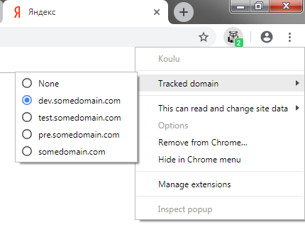

# Koulu - Google Chrome cookie tracker extension

In some cases it is necessary to copy cookies from one domain to another on scheduled basis.

For example, for development or testing purposes.


## Installation

You can download this extension and install it into the Chrome via "Extensions -> Load unpacked".

After that it will be available in the navigation bar. Like this:




## Configuration

Extension can be configured via the _config.js_ file. 
You need to set some configuration variables here.

Sample config contains these lines:
```js
const OPT_COPY_TO_DOMAIN = 'localhost';
const OPT_TRACKED_COOKIES = ['JSESSIONID', 'XSRF-TOKEN'];
const OPT_TRACKED_DOMAINS = [
    'dev.somedomain.com',
    'test.somedomain.com',
    'pre.somedomain.com',
    'somedomain.com'
];

const OPT_TRACKED_PING_URL = 'https://${DOMAIN}/api/ping';
```

Imagine that you have selected __dev.somedomain.com__ in the menu.

It means that __dev.somedomain.com__ will be pinged and __JSESSIONID__ and __XSRF-TOKEN__ cookies 
periodically (every minute) will be copied from the __dev.somedomain.com__ to the __localhost__.

### Config options
- `OPT_COPY_TO_DOMAIN` - The domain to write cookies to.
- `OPT_TRACKED_DOMAINS` - List of domains to read cookies from. 
- `OPT_TRACKED_COOKIES` - List of cookie names to copy.
- `OPT_TRACKED_PING_URL` - In some cases it is necessary sometimes to ping the server from where you are reading cookies 
(to prolong user session, to health-check/heart-beat, or just to refresh cookies).
You can specify the URL in this variable. Set it to `null` if you don't need to do such pings.

You can select only one domain in a time in the menu. Or select **None** to disable extension activity.

## Permissions

In the _manifest.json_ you need specify URL patterns for all domains you are going to work with.
Replace "somedomain.com" and "localhost" with your actual domains in the `permissions` section.
These permissions are necessary to allow the extension to read and write cookies. 

```json
{
  "permissions": [
    "*://*.somedomain.com/",
    "*://localhost/"
  ]
}
``` 